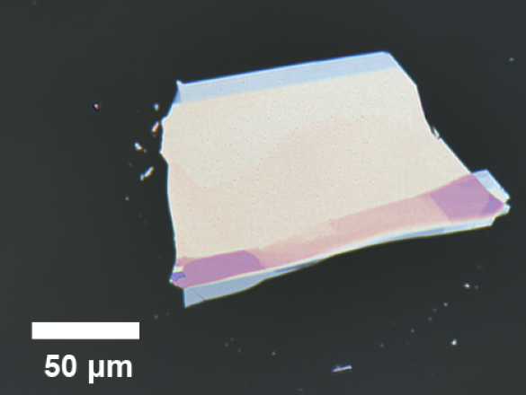

---
---

The Ling lab aims at exploring the light-matter interactions in nanoscale electronic and photonic devices and newly emerging materials for further advancing the semiconductor technology. **We are actively expanding and are currently looking for PhD, Master, and undergraduate students to join our team!** Please see [here](team) for more information.

# My Image Slider

  

    
    
    
  

  
  <button class="prev" onclick="plusSlides(-1)">&#10094;</button>
  <button class="next" onclick="plusSlides(1)">&#10095;</button>

We are a new, growing research group residing in the [Mechanical and Aerospace Engineering Department](https://mae.ucf.edu/) at UCF. There are two major research thrusts in our lab:
* Design, fabrication, and characterization of electronic and photonic devices based on novel material systems, including low dimensional materials, phase change materials, superlattice structures, with improved capabilities
* Understanding the energy transfer mechanism in newly emerging material platforms such as layered van der Waals materials via optical spectroscopic and microscopic techniques

<!-- end of the list -->

Please see [Research](research) for more details. 
